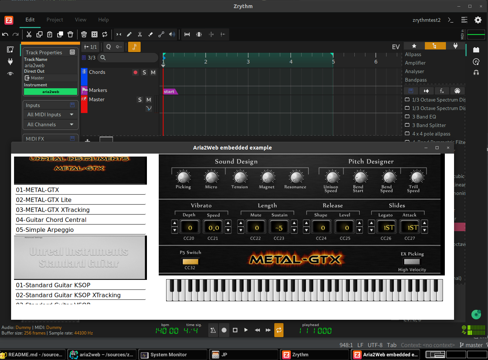

# aria2web README

`aria2web` is a simple JS+HTML page that brings SFZ [ARIA extensions](https://sfzformat.com/extensions/aria/xml_instrument_bank) XML instrument bank to Web (HTML+SVG) using [webaudio-controls](https://github.com/g200kg/webaudio-controls/). This repository contains copies of JS files from webaudio-controls project.

An online demo UI is available at: https://aria2web.firebaseapp.com/ (Note that Web UI is really only for UI, no audio involved. Those sfz soundfonts can be 1GB-ish, which are not suitable for Web Audio in 2020).

Right now we use [Vue.js](https://vuejs.org/) but the templating part is really simple so it can be anything. Maybe we don't even need any.

There are handful of great instruments with ARIA UI such as  [Unreal Instruments](https://unreal-instruments.wixsite.com/unreal-instruments). In this PoC repository we import these instruments:

- [UI Standard Guitar](https://unreal-instruments.wixsite.com/unreal-instruments/standard-guitar) 
- [UI METAL GTX](https://unreal-instruments.wixsite.com/unreal-instruments/metal-gtx)
- [UI 1912](https://unreal-instruments.wixsite.com/unreal-instruments/1912)
- [karoryfer-bigcat.cello](https://github.com/sfzinstruments/karoryfer-bigcat.cello)

## Rationale

The real value in this experimental project lies in that the entire UI is based on **complete** web technology ecosystem, not just part of it. For example, [Blueprint](https://github.com/nick-thompson/blueprint) is a great React integration for audio plugins, but still needs full backend implementation just like React Native (but for its own), which is not going to be complete. Full SVG implementation, HTML5 Canvas, WebGL etc. including full access to the DOM integration, is what we want, to achieve "any Web application authoring tool works" state of union.

Another reason for Web technology-based UI is a host-loadable UI for a remote plugin, which may sound tricky but an option for [Android platform](https://github.com/atsushieno/android-audio-plugin-framework/issues/34).

## Embedded hosting

aria2web is designed to be used for audio plugin UI. `aria2web-host.c` is a proof-of-concept HTTP server and WebView app that shows the program (instrument) list like a native UI using [zserge/webview](https://github.com/zserge/webview) and [jeremycw/httpserver.h](https://github.com/jeremycw/httpserver.h). So far it only logs note on/off and control changes from the UI (they are the whole supported messages by `webaudio-controls` anyways), but you would get the basic concept on how it could be used.

## lv2 plugin UI

`aria2web-lv2ui` is the LV2 plugin UI implementation. It is to provide a fully-functional SFZ sampler UI using [sfztools/sfizz](https://github.com/sfztools/sfizz/). Though unlike sfizz itself, aria2web [does not support run-time UI loading](https://github.com/atsushieno/aria2web/issues/3) (the HTML pages must be pre-generated) yet.

The actual sfizz integration is ongoing. We use a sfizz submodule, with some uncommitted changes to the codebase, which replaces most of the sfizz URI with aria2web: https://gist.github.com/atsushieno/37d5686d6bad5ee04d85d2b45258e0c9 . (It's an ugly hack, but we should use different name and URI to not conflict with sfizz which may be locally installed.)

To build native hosting stuff, you will have to install sfizz dependencies such as libjack-dev and libsndfile-dev, then run `./build.sh`. As the build result, there will be `sfizz-aria2web/dist/lib/lv2/sfizz.lv2` directory.

The plugin UI is neither X11, Gtk2/3 or Qt4/5 but is [KXStudio external UI namespace](https://kx.studio/ns/lv2ext/external-ui). The actual UI is `aria2web-host` running on its own isolated process. Since it uses WebKitGtk, you'll need it locally installed. The process isolation and management is [still an ongoing work](https://github.com/atsushieno/aria2web/issues/4), but the UI shows up on zrythm and qtractor.

## Debugging

Debugging HTML parts is easy; you can just use any HTTP server e.g. `npx http-server`, open `index.html` from any browser, and use its debugging console. (You cannot open the page as in `file:` URL because the app needs access to local resources which is not allowed for the scheme.)

Debugging the LV2 UI plugin is not intuitive. For @atsushieno, the debuggee is `zrythm` which is locally built and installed, with LV2_PATH that points to `sfizz-aria2web/dist/lib/lv2` mentioned above.

## Licenses

- My code (`aria2web*`) is available under the MIT License.
- webaudio-controls, webcomponents-lite, and Vue.js are distributed by each developers under their respective licenses (Apache, BSD-like, MIT).
- `httpserver.h`, `webview`, and `tiny-process-library` are available under the MIT license.
- sfizz is available under the BSD license.
- UI METAL GTX, UI Standard Guitar, and UI 1912 are freely available like public domain (no credits required: `＊ライセンスについて ・ライセンスフリーです ・クレジット表記は不要です`).
- karoryfer-bigcat.cello is under CC-BY 4.0 License.
