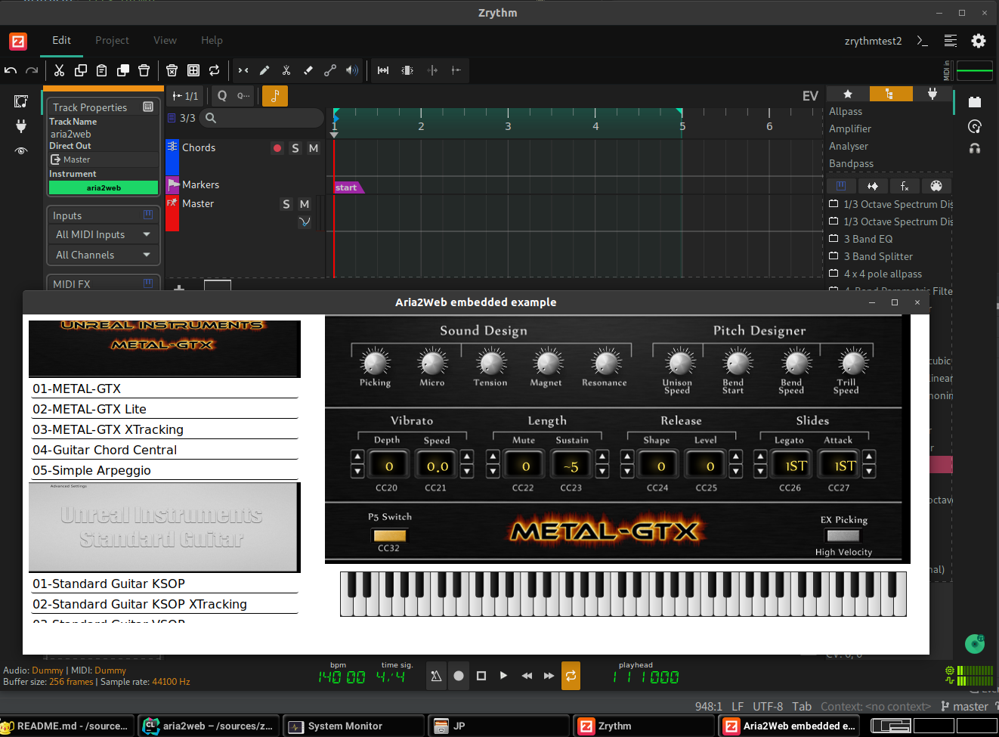
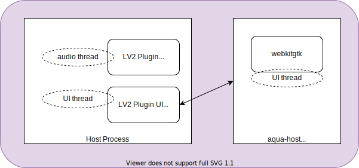

# aqua README



`aqua` is a simple JS+HTML page that brings SFZ [ARIA extensions](https://sfzformat.com/extensions/aria/xml_instrument_bank) XML instrument bank to Web (HTML+SVG) using [g200kg/webaudio-controls](https://github.com/g200kg/webaudio-controls/).

An online demo UI is available at: https://aqua.firebaseapp.com/ (Note that Web UI is really only for UI, no audio involved. Those sfz soundfonts can be 1GB-ish, which are not suitable for Web Audio in 2020).

Right now we use [Vue.js](https://vuejs.org/) but the templating part is really simple so it can be anything. Maybe we don't even need any.

There are handful of great instruments with ARIA UI. In this PoC repository we import these instruments:

- [UI Standard Guitar](https://unreal-instruments.wixsite.com/unreal-instruments/standard-guitar)
- [UI METAL GTX](https://unreal-instruments.wixsite.com/unreal-instruments/metal-gtx)
- [UI 1912](https://unreal-instruments.wixsite.com/unreal-instruments/1912)
- [karoryfer-bigcat.cello](https://github.com/sfzinstruments/karoryfer-bigcat.cello)

## Building and Using

See "LV2 Plugin UI" section.

To use it as a local LV2 plugin, you would need an extra configuration file under `~/.config/aqua.config` file. It is not really a config file so far, just stores list of bank XML files. For example, mine is:

```
/home/atsushi/soundfonts/sfz/karoryfer.bear-sax-master/Bear_Sax.bank.xml
/home/atsushi/soundfonts/sfz/karoryfer-bigcat.cello-master/Karoryfer x bigcat cello.bank.xml
/home/atsushi/soundfonts/sfz/karoryfer.caveman-cosmonaut-master/Caveman Cosmonaut.bank.xml
/home/atsushi/soundfonts/sfz/karoryfer.string-cyborgs-master/String Cyborgs.bank.xml
/home/atsushi/soundfonts/sfz/karoryfer.weresax-master/Weresax.bank.xml
/home/atsushi/soundfonts/sfz/UI_1912/1912.bank.xml
/home/atsushi/soundfonts/sfz/UI_METAL-GTX/METAL-GTX.bank.xml
/home/atsushi/soundfonts/sfz/UI_Standard_Guitar/Standard Guitar.bank.xml
```

## Rationale

The real value in this experimental project lies in that the entire UI is based on **complete** web technology ecosystem, not just part of it. For example, [Blueprint](https://github.com/nick-thompson/blueprint) is a great React integration for audio plugins, but still needs full backend implementation just like React Native (but for its own), which is not going to be complete. Full SVG implementation, HTML5 Canvas, WebGL etc. including full access to the DOM integration, is what we want, to achieve "any Web application authoring tool works" state of union.

For example, webaudio-controls is maintained by exactly the same person (g200kg) who also created [KnobMan](https://www.kvraudio.com/product/knobman-by-g200kg) which is most likely used by many ARIA Knob designers. The same image format is widely used by Kontakt nki designers too, they are all the same. It is why aqua achieves so complete UI results.

It should be also possible to use Web UI part of this project in the latest [iPlug2](https://github.com/iPlug2/iPlug2) [WebUI](https://github.com/iPlug2/iPlug2/tree/master/Examples/IPlugWebUI) support (see the head part of `aqua.js` to see what kind of WebView hooks are required).

Another reason for Web technology-based UI is a host-loadable UI for a remote plugin, which may sound tricky but an option for [Android platform](https://github.com/atsushieno/android-audio-plugin-framework/issues/34).

## Embedded hosting

aqua is designed to be used for audio plugin UI. `aqua-host.c` is a proof-of-concept HTTP server and WebView app that shows the program (instrument) list like a native UI using [zserge/webview](https://github.com/zserge/webview) and [jeremycw/httpserver.h](https://github.com/jeremycw/httpserver.h). So far it only logs note on/off and control changes from the UI (they are the whole supported messages by `webaudio-controls` anyways), but you would get the basic concept on how it could be used.

## LV2 plugin UI

`aqua-lv2ui` is the [LV2](https://lv2plug.in/) plugin UI implementation. It is to provide a fully-functional SFZ sampler UI using [sfztools/sfizz](https://github.com/sfztools/sfizz/) LV2 (non-UI) plugin. Though unlike sfizz itself, aqua only supports ARIA bank XML (i.e. no support for `.sfz`) so far.

To build native hosting stuff, you will have to install sfizz dependencies such as `libjack-jackd2-dev` and `libsndfile-dev`. Make sure that you clone submodules in `external/sfizz` too. Then run `./build.sh`.

(We use a sfizz submodule, with some uncommitted changes to the codebase, which replaces most of the sfizz URI with aqua with `sfizz-to-aqua.patch` (It's an ugly hack, but we should use different name and URI to not conflict with sfizz which may be locally installed.), as well as copied-and-regex-replaced `sfizz.ttl` renamed as `aqua.ttl`.)

As the build result, there will be `sfizz-aqua/dist/lib/lv2/sfizz.lv2` directory. You can either copy the directory into your LV2 plugins directory (e.g. `~/.lv2/`, probably renaming it as `aqua.lv2`) or specify `LV2_PATH` to the directory.

### UI architecture

The plugin UI is neither X11, Gtk2/3 or Qt4/5 but is [KXStudio external UI namespace](https://kx.studio/ns/lv2ext/external-ui). The actual UI is `aqua-host` standalone program, running on its own isolated process. Since it uses WebKitGtk, you'll need it locally installed, but the UI shows up on zrythm and qtractor or perhaps any plugin host that supports the namespace.



The inter-process messaging between LV2 UI plugin and the standalone process is done by simple and stupid pipes, with lots of help by [eidheim/tiny-process-library](https://gitlab.com/eidheim/tiny-process-library/).

Current standalone host implementation is GTK-specific, but it is cosmetic to make it work for other OS-es, just a matter of tweaking the window handle a little bit (show / hide / disable close button).

### Limitations

There is a lot of "unsupported opcodes" in sfizz. There are sfz v1, v2, Cakewalk extensions, ARIA extensions, etc. See [SFZ Opcodes](https://sfzformat.com/misc/all_opcodes) for details. Those unsupported opcodes are reported by sfizz when it is loaded.

ARIA GUI extension shows knobs, sliders, and buttons for CCs (control changes), but those settings are not stored as sfizz plugin state, as they are rather part of MIDI messages which would be saved as song data.

## Debugging

Debugging HTML parts is easy; you can just use any HTTP server e.g. `npx http-server`, open `index.html` from any browser, and use its debugging console. (You cannot open the page as in `file:` URL because the app needs access to local resources which is not allowed for the scheme.)

For debugging Web UI host standalone UI, you can use native debuggers like `gdb` or `lldb` for `aqua-host`. It accepts stdin, so you can send commands like `SFZ /path/to/target/sfz`. The window doesn't have a close button, typing `quit` lets it close.

Debugging the LV2 UI plugin is not intuitive. For @atsushieno, the debuggee is `zrythm` which is locally built and installed, with `LV2_PATH` that points to `sfizz-aqua/dist/lib/lv2` mentioned above.


## Licenses

- My code (`aqua*`) is available under the MIT License.
- webaudio-controls, webcomponents-lite, and Vue.js are distributed by each developers under their respective licenses (Apache, BSD-like, MIT).
- `httpserver.h`, `webview`, and `tiny-process-library` are available under the MIT license.
- sfizz is available under the BSD license.
- UI METAL GTX, UI Standard Guitar, and UI 1912 are freely available like public domain (no credits required: `＊ライセンスについて ・ライセンスフリーです ・クレジット表記は不要です`).
- karoryfer-bigcat.cello is under CC-BY 4.0 License.
